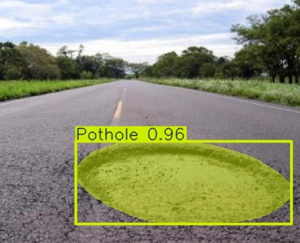
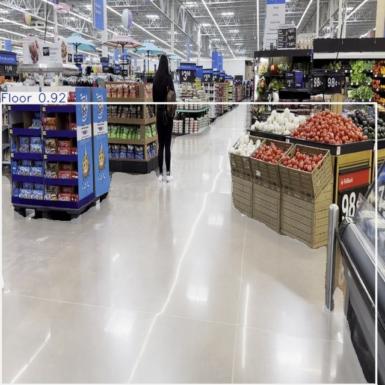
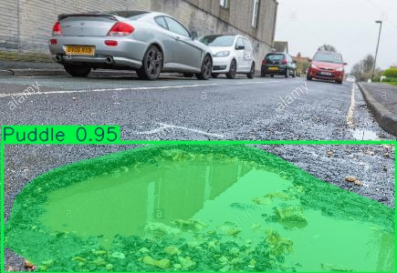
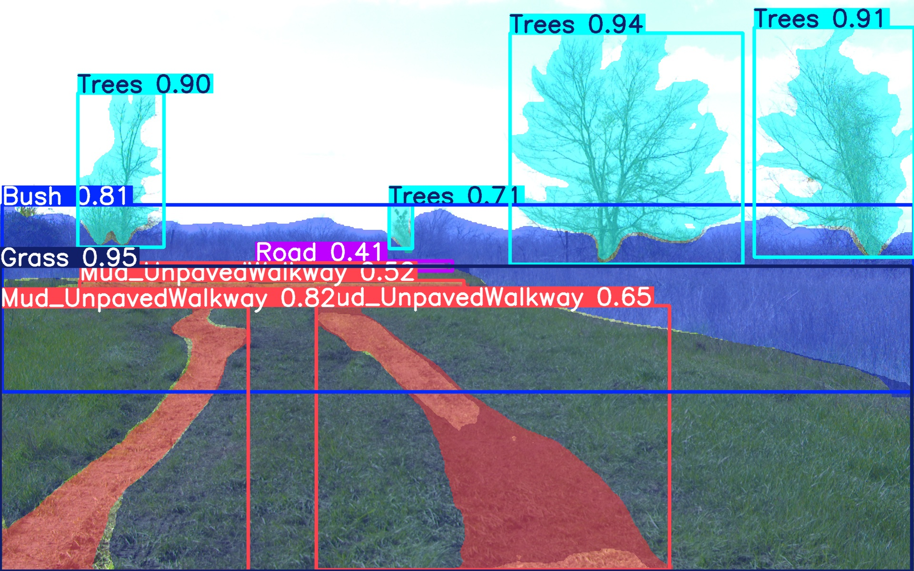
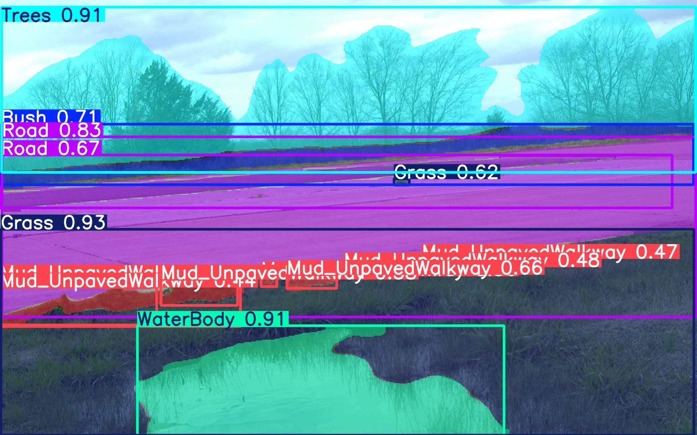
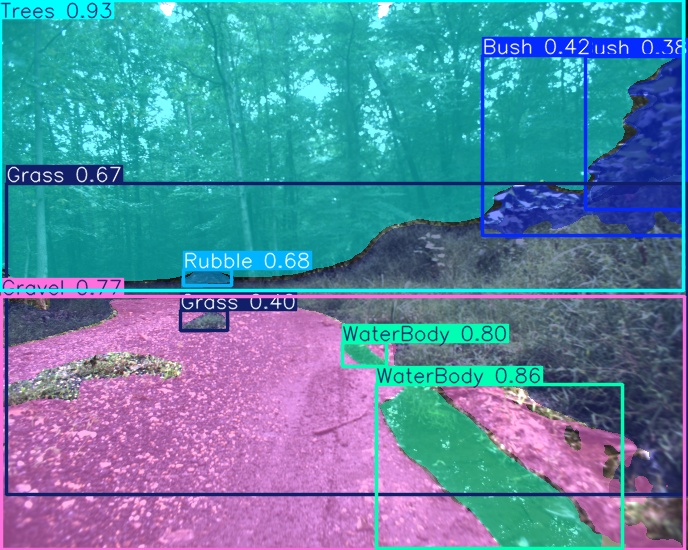
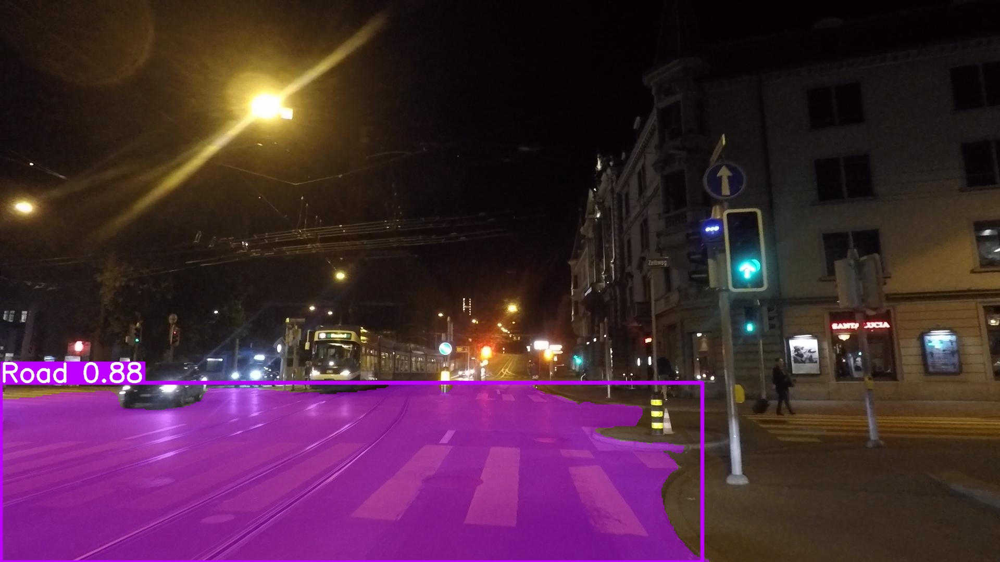
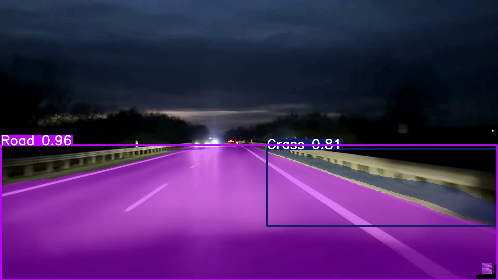

# Terrain Traversability Segmentation for Autonomous Ground Robots

<p align="center">
  
</p>

<p align="center">


</p>

---

## Overview

Autonomous robots operating in real-world environments require more than obstacle detection. They must understand terrain semantics, identify hazards, and estimate traversability to make safe navigation decisions.

This project presents a real-time semantic terrain segmentation framework capable of identifying **19 terrain and environmental classes** across diverse operating conditions including:

* Day and Night
* Indoor and Outdoor
* Structured and Unstructured Terrain
* Smoke and Reduced Visibility Conditions

The segmentation output is converted into traversability-aware terrain information and integrated into a Terrain Mapping Module (TMM) for downstream navigation.

The system is optimized for deployment on **NVIDIA Jetson AGX Orin** using **TensorRT FP16** and operates at approximately **15 Hz while the navigation stack is running**.

---

## Key Features

### Perception

* 19-Class Semantic Segmentation
* Terrain Understanding
* Hazard Identification
* Traversability Mapping
* Day/Night Operation
* Structured and Unstructured Environments

### Dataset Engineering

* Custom Terrain Dataset
* Multi-Scenario Data Collection
* Annotation Quality Control
* Dataset Health Analysis
* Class Distribution Auditing
* Multi-Label Stratified Splitting

### Model Development

* Binary Road Segmentation Baseline
* Multi-Class Terrain Segmentation
* YOLO11m-Seg Training Pipeline
* Hyperparameter Optimization
* Comparative Model Evaluation

### Deployment

* ONNX Export
* TensorRT Optimization
* FP16 Inference
* NVIDIA Jetson AGX Orin Deployment
* Real-Time Navigation Integration

---

# Problem Statement

Traditional navigation systems often treat all free space equally.

However, not all terrain is equally traversable.

Examples:

| Terrain    | Traversability     |
| ---------- | ------------------ |
| Road       | High               |
| Floor      | High               |
| Grass      | Medium             |
| Gravel     | Medium             |
| Mud        | Low                |
| Water Body | Unsafe             |
| Trench     | Unsafe             |
| Pothole    | Unsafe             |
| Fire       | Hazard             |
| Smoke      | Reduced Visibility |

This project bridges the gap between semantic scene understanding and terrain-aware navigation.

---

# Dataset

## Dataset Characteristics

The dataset was collected to represent realistic robotic operating environments.

### Operating Conditions

* Day
* Night
* Indoor
* Outdoor
* Structured Terrain
* Unstructured Terrain
* Smoke Conditions
* Variable Illumination

---

## Semantic Classes

| ID | Class      |
| -- | ---------- |
| 0  | Bush       |
| 1  | Dirt       |
| 2  | Floor      |
| 3  | Footpath   |
| 4  | Grass      |
| 5  | Gravel     |
| 6  | Mud        |
| 7  | Pothole    |
| 8  | Puddle     |
| 9  | Road       |
| 10 | Rubble     |
| 11 | Stairs     |
| 12 | Trees      |
| 13 | Trench     |
| 14 | Water Body |
| 15 | Fire       |
| 16 | Smoke      |
| 17 | Slushy     |
| 18 | Hill       |

---

# Project Evolution

```text
Binary Road Segmentation
            ↓
Multi-Class Terrain Segmentation
            ↓
YOLO11m-Seg
            ↓
Traversability Mapping
            ↓
Jetson Deployment
```

---

# System Architecture

```text
ZED2 Camera
      ↓
YOLO11m-Seg
      ↓
Semantic Segmentation Mask
      ↓
Traversability Mapping
      ↓
Terrain Mapping Module (TMM)
      ↓
Navigation Stack
```

---

# Dataset Engineering Pipeline

```text
Data Collection
        ↓
Annotation
        ↓
Quality Assurance
        ↓
Dataset Auditing
        ↓
Stratified Splitting
        ↓
Training
        ↓
Evaluation
```

---

# Training Pipeline

## Model

YOLO11m-Seg

### Why YOLO11m-Seg?

* Excellent speed-to-accuracy tradeoff
* Real-time deployment capability
* Efficient memory utilization
* Strong small-object segmentation performance
* Suitable for edge robotics platforms

---

## Dataset Split Strategy

To prevent distribution bias and improve generalization:

* Multi-label stratified split
* Rare-class preservation
* Class-balance monitoring
* Dataset health auditing

This ensures all terrain categories remain represented in training and validation datasets.

---

# Deployment Pipeline

```text
PyTorch (.pt)
      ↓
ONNX Export
      ↓
TensorRT Engine
      ↓
Jetson AGX Orin
      ↓
Real-Time Inference
```

---

## Deployment Hardware

### Camera

* ZED2 Stereo Camera

### Compute Platform

* NVIDIA Jetson AGX Orin

### Runtime

* TensorRT FP16

---

# Performance

## System-Level Performance

| Metric                 | Value                 |
| ---------------------- | --------------------- |
| Platform               | Jetson AGX Orin       |
| Runtime                | TensorRT FP16         |
| Camera                 | ZED2                  |
| Output                 | Semantic Segmentation |
| Navigation Stack       | Enabled               |
| Traversability Mapping | Enabled               |
| Throughput             | ~15 Hz                |

Unlike isolated benchmark measurements, the reported throughput reflects full system operation while running the navigation stack.

---

# Results

## Qualitative Results

### Day Conditions

<p align="center">

</p>
<p align="center">

</p>
<p align="center">

</p>
<p align="center">

</p>
<p align="center">

</p>
<p align="center">

</p>


---

### Night Conditions

<p align="center">

</p>
<p align="center">

</p>


---

---

# Failure Analysis

Understanding failure modes is critical for safe autonomous navigation.

Current analysis focuses on:

### Terrain Confusions

* Grass ↔ Bush
* Gravel ↔ Rubble
* Dirt ↔ Mud

### Hazard Detection Challenges

* Pothole boundary estimation
* Trench segmentation
* Water under shadow conditions

### Environmental Challenges

* Night illumination
* Dense smoke
* Strong shadows
* Motion blur

Future work focuses on reducing these failure modes through dataset expansion and targeted augmentation.

---

# Repository Structure

```text
Terrain-Traversability-Segmentation/
│
├── README.md
│
├── docs/
│   ├── dataset.md
│   ├── annotation_guidelines.md
│   ├── dataset_health.md
│   ├── training.md
│   ├── deployment.md
│   ├── benchmarking.md
│   ├── results.md
│   ├── failure_analysis.md
│   └── architecture.md
│
├── datasets/
│
├── models/
│
├── src/
│
├── results/
│
└── assets/
```

---

# Future Work

## Short Term

* Expanded night dataset
* Improved rare-class coverage
* Additional failure-case mining
* Enhanced traversability reasoning

## Long Term

* ROS2 Package Release
* Multi-Camera Support
* Dynamic Terrain Adaptation
* Uncertainty-Aware Perception
* Multi-Robot Deployment

---

# Documentation

Additional project documentation:

* Dataset Description
* Annotation Guidelines
* Dataset Health Report
* Training Configuration
* Deployment Guide
* Benchmarking Results
* Failure Analysis

Refer to the `docs/` directory.

---

# License

This project is released under the MIT License.

---

# Author

**Arashdeep Singh**

Robotics Engineer | Autonomous Systems | Perception & Navigation

Focused on developing deployable perception systems for autonomous ground and aerial robots.
