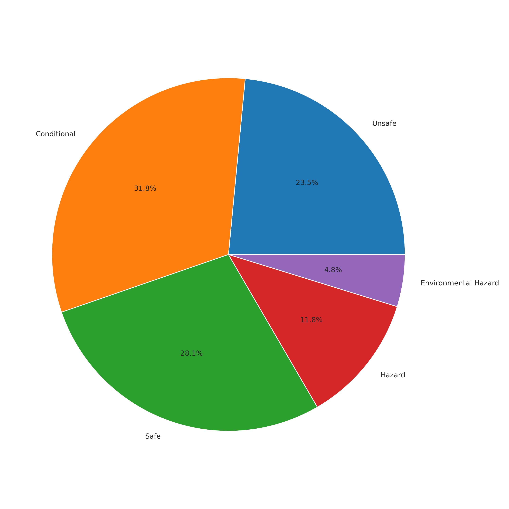
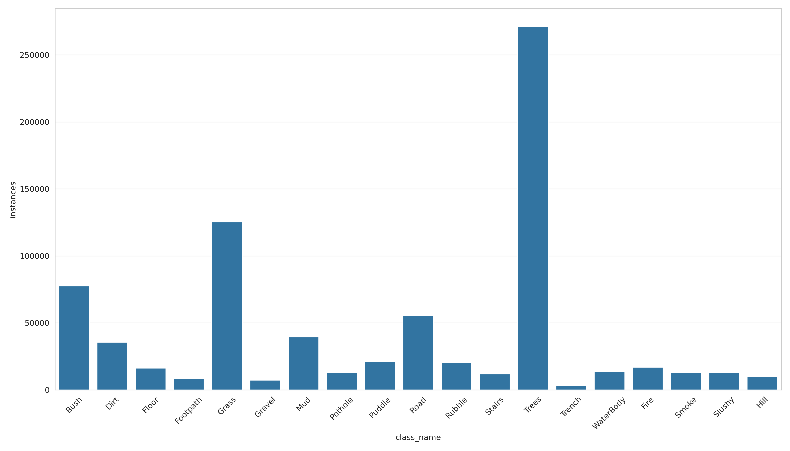
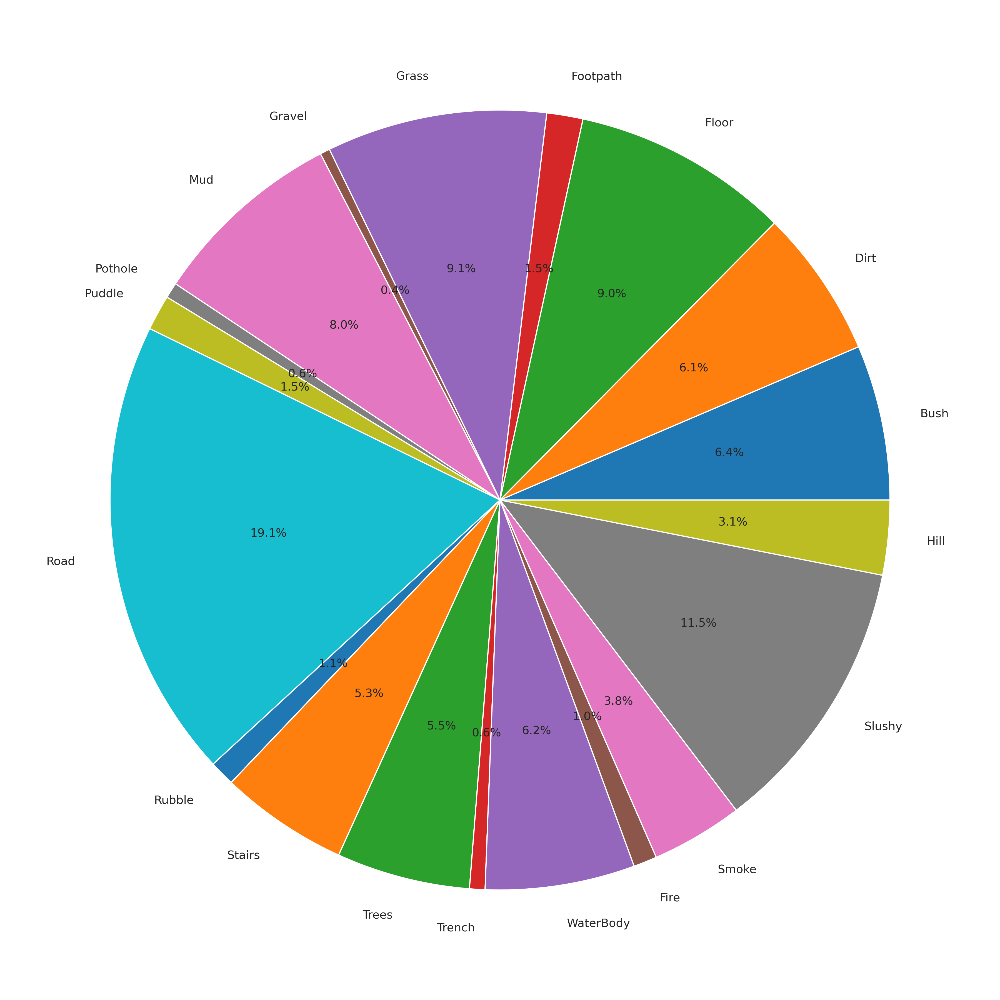
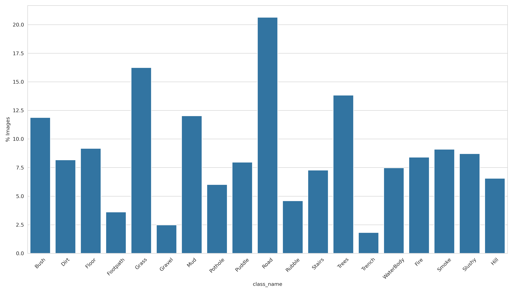
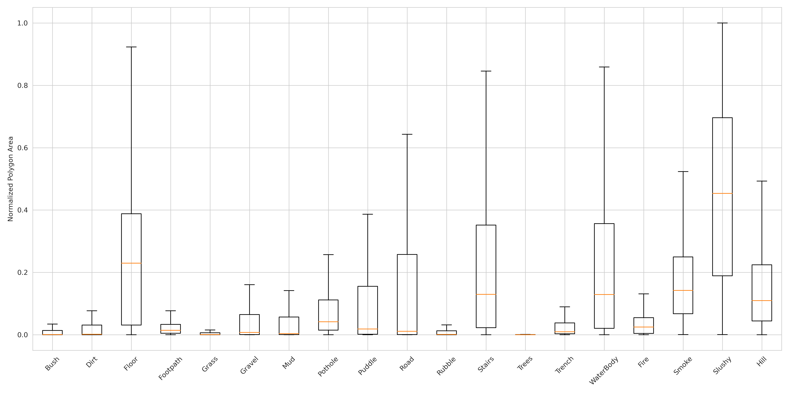
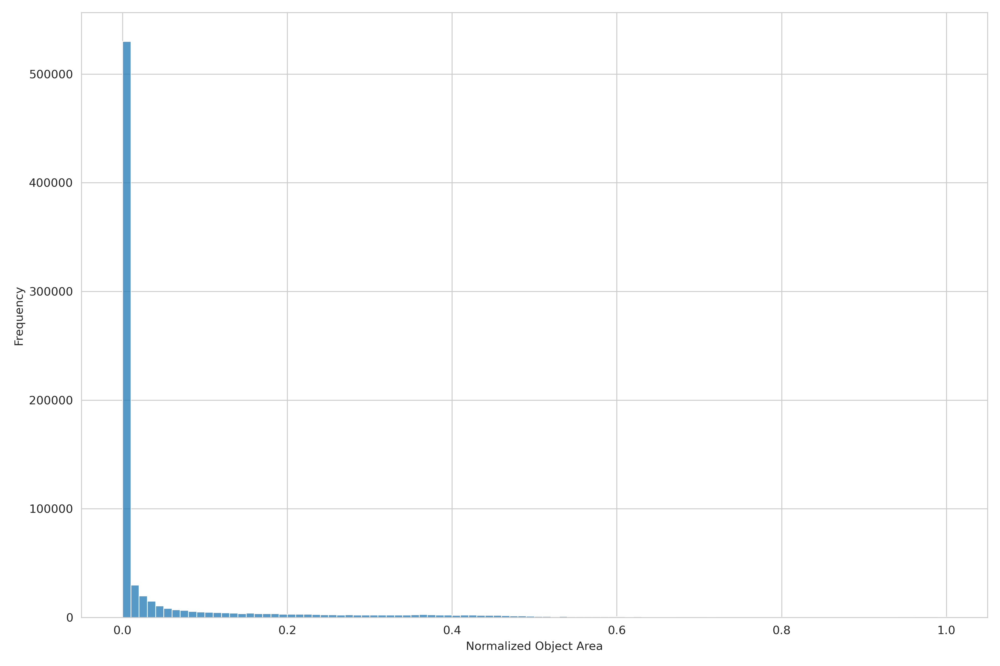
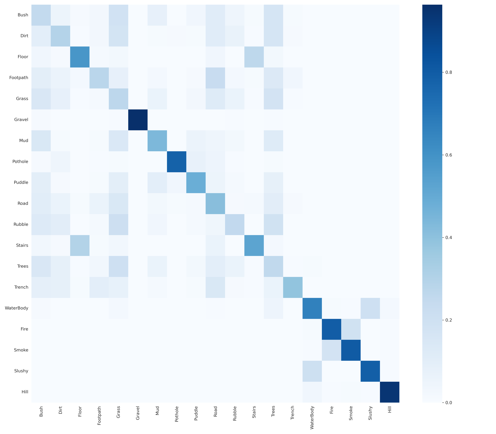

# Dataset Documentation

## Overview

This dataset was developed for semantic terrain understanding and traversability-aware perception in autonomous ground robots.

The objective is to provide robust semantic understanding across diverse operational environments and enable downstream navigation systems to reason about terrain safety, hazards, and mobility constraints.

Unlike conventional road segmentation datasets, this dataset focuses on both terrain semantics and environmental hazards encountered in real-world robotic deployments.

---

# Dataset Objectives

The dataset was designed to support:

* Semantic terrain segmentation
* Hazard detection
* Traversability estimation
* Autonomous navigation
* Real-time robotic perception
* Deployment on edge computing platforms

---

# Operational Environments

Data was collected across diverse environmental conditions to improve generalization and robustness.

## Lighting Conditions

* Day
* Night
* Low Illumination
* High Contrast Scenes

---

## Environmental Conditions

* Indoor
* Outdoor
* Structured Terrain
* Unstructured Terrain
* Smoke Conditions
* Variable Visibility

---

## Terrain Diversity

The dataset includes:

* Paved Roads
* Footpaths
* Gravel
* Grass
* Dirt
* Mud
* Rubble
* Hills
* Water Bodies
* Stairs

---

# Semantic Taxonomy

The dataset contains 19 semantic classes.

| ID | Class      | Description                           |
| -- | ---------- | ------------------------------------- |
| 0  | Bush       | Dense vegetation and shrubs           |
| 1  | Dirt       | Exposed soil surfaces                 |
| 2  | Floor      | Indoor traversable flooring           |
| 3  | Footpath   | Pedestrian walkways                   |
| 4  | Grass      | Grass-covered terrain                 |
| 5  | Gravel     | Loose stone surfaces                  |
| 6  | Mud        | Soft deformable terrain               |
| 7  | Pothole    | Localized depressions in terrain      |
| 8  | Puddle     | Shallow water accumulation            |
| 9  | Road       | Paved vehicle traversable surface     |
| 10 | Rubble     | Debris and broken materials           |
| 11 | Stairs     | Staircases and stepped structures     |
| 12 | Trees      | Tree trunks and dense tree structures |
| 13 | Trench     | Deep cuts or excavations              |
| 14 | Water Body | Rivers, ponds, lakes, standing water  |
| 15 | Fire       | Visible flames                        |
| 16 | Smoke      | Smoke and reduced visibility regions  |
| 17 | Slushy     | Snow-mud mixed terrain                |
| 18 | Hill       | Elevated sloped terrain               |

---

# Traversability Categories

For robotic navigation, semantic classes are further grouped according to traversability.

## Fully Traversable

| Class |
| ----- |
| Road  |
| Floor |

---

## Conditionally Traversable

| Class    |
| -------- |
| Grass    |
| Gravel   |
| Dirt     |
| Footpath |
| Hill     |
| Slushy   |

Traversability depends on:

* Vehicle type
* Wheel configuration
* Terrain condition
* Weather

---

## Hazardous Terrain

| Class   |
| ------- |
| Mud     |
| Pothole |
| Puddle  |
| Rubble  |
| Trench  |

These classes introduce elevated mobility risk.

---

## Non-Traversable

| Class      |
| ---------- |
| Water Body |
| Trees      |
| Bush       |
| Stairs     |

---

## Environmental Hazards

| Class |
| ----- |
| Fire  |
| Smoke |

These classes impact mission safety and visibility.
## Traversability Distribution

<p align="center">

</p>

The semantic classes are grouped into navigation-relevant traversability categories.
---

# Data Collection Strategy

The dataset was collected to maximize environmental diversity while maintaining annotation consistency.

## Collection Goals

* Diverse terrain appearances
* Multiple illumination conditions
* Varying viewpoints
* Real operational scenarios
* Rare hazard inclusion

---

## Collection Sources

Data includes imagery collected from:

* Ground robot platforms
* Field deployments
* Outdoor surveys
* Structured environments
* Unstructured environments

---

# Annotation Pipeline

The annotation workflow follows:

```text
Image Acquisition
        ↓
Manual Annotation
        ↓
Quality Review
        ↓
Correction Pass
        ↓
Dataset Validation
        ↓
Training Dataset
```

---

# Annotation Format

The dataset uses YOLO Segmentation format.

Example:

```text
class_id x1 y1 x2 y2 x3 y3 ...
```

Each annotation represents a polygon describing the semantic region boundary.

---

# Dataset Quality Assurance

To maintain annotation quality:

* Annotation review process
* Polygon consistency checks
* Label validation
* Duplicate removal
* Corrupted image filtering
* Class coverage verification

---

# Dataset Auditing

Dataset quality is continuously monitored using automated auditing tools.

Auditing metrics include:

* Class Frequency
* Pixel Distribution
* Image Presence Percentage
* Average Instance Area
* Rare Class Detection
* Dominant Class Detection
* Dataset Entropy
* Tail Class Ratio

# Dataset Statistics

## Dataset Summary

| Metric | Value |
|----------|----------|
| Total Images | 131,909 |
| Total Classes | 19 |
| Dataset Health Score | 93.57 / 100 |
| Coverage Score | 1.00 |
| Entropy Score | 0.875 |
| Balance Score | 0.952 |

The dataset demonstrates strong class coverage, balanced semantic representation, and high diversity across operational environments.

### Class Distribution

<p align="center">

</p>

The figure shows the instance frequency of all semantic classes in the dataset.

### Pixel Distribution

<p align="center">

</p>

Pixel distribution provides a better estimate of visual dominance than instance counts alone.
### Image Presence Distribution

<p align="center">

</p>

Image presence indicates how frequently a semantic class appears throughout the dataset.
### Class Area Distribution

<p align="center">

</p>

Distribution of normalized polygon area for each semantic class.

### Object Size Distribution

<p align="center">

</p>

Object size distribution helps identify classes dominated by small targets such as Fire, Pothole, and Puddle.

### Class Co-Occurrence Analysis

<p align="center">

</p>

The co-occurrence matrix highlights semantic relationships between terrain and hazard classes.
---
# Dataset Insights

### Key Observations

- Dataset contains 131,909 annotated images.
- All 19 semantic classes are represented.
- Dataset Health Score is 93.57/100.
- Road contributes approximately 19% of total annotated pixels.
- Slushy contributes over 11% of total pixels despite appearing in fewer than 9% of images.
- Fire appears in more than 16,000 annotated instances while occupying less than 1% of total pixels.
- Smoke occupies significantly larger image regions than Fire.
- No single class dominates the dataset, resulting in a high entropy score of 0.875.

# Dataset Splitting Strategy

A multi-label stratified split is used to preserve rare classes and maintain class balance.

## Objectives

* Preserve rare classes
* Avoid dataset bias
* Improve validation reliability
* Maintain class diversity

---

## Dataset Split

| Split      | Percentage |
| ---------- | ---------- |
| Training   | 80%        |
| Validation | 20%        |

The split process ensures semantic coverage is maintained across both sets.

---

# Dataset Challenges

Several classes present significant challenges.

## Small Objects

* Fire
* Pothole
* Puddle

---

## Ambiguous Boundaries

* Grass ↔ Bush
* Dirt ↔ Mud
* Gravel ↔ Rubble

---

## Environmental Challenges

* Smoke Occlusion
* Night Scenes
* Shadow Regions
* Low Contrast Conditions

---

# Intended Applications

This dataset supports:

* Autonomous Ground Vehicles
* Mobile Robots
* Terrain Understanding
* Traversability Analysis
* Hazard Detection
* Edge AI Deployment
* Robotic Navigation Systems

---

# Future Dataset Expansion

Future versions will focus on:

* Additional night data
* Seasonal variation
* Weather diversity
* Rare class enrichment
* Cross-domain generalization
* Long-term deployment robustness

---

# Dataset Versioning

## Version 1.0

* Binary road segmentation

## Version 2.0

* Multi-class terrain segmentation

## Version 3.0

* 19-class traversability-oriented dataset

Future versions will continue expanding environmental diversity and operational coverage.
