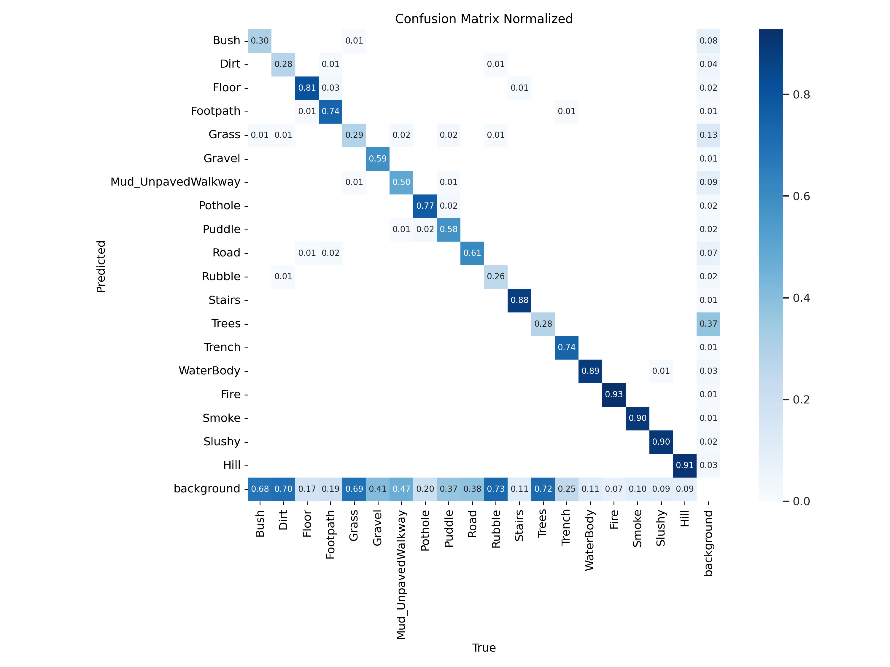
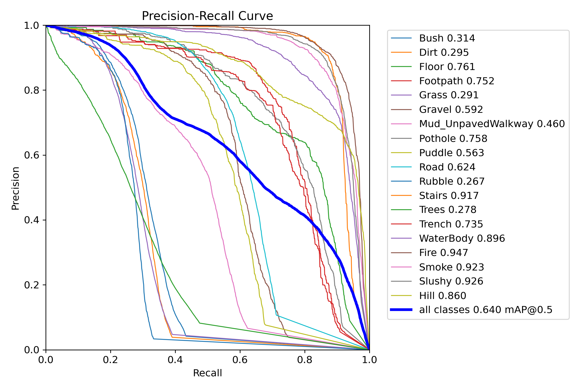
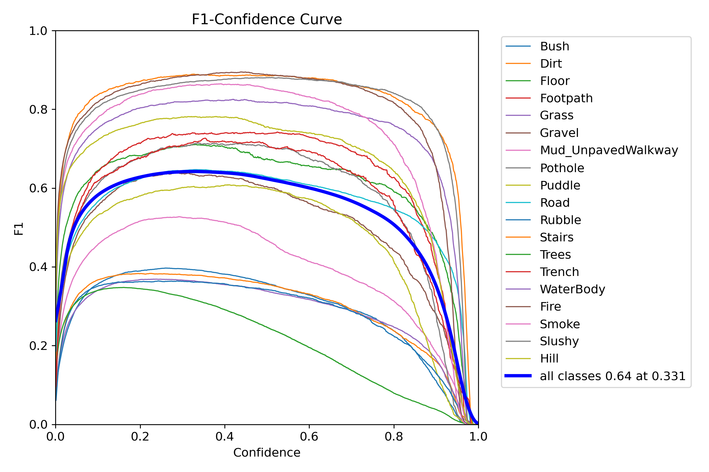

# Results

## Overview

This document presents qualitative and quantitative results obtained from the Terrain Traversability Segmentation system.

The objective of the evaluation is to assess:

* Semantic segmentation quality
* Terrain understanding capability
* Hazard recognition performance
* Deployment readiness
* Traversability reasoning

The results include both visual demonstrations and deployment performance metrics.

---

# Quantitative Results

## Validation Performance

Model: YOLO11m-Seg

Dataset: 19-Class Terrain Segmentation Dataset

Validation Images: 21,379

### Overall Metrics

| Metric | Bounding Box | Segmentation Mask |
|----------|----------|----------|
| Precision | 0.747 | 0.749 |
| Recall | 0.639 | 0.613 |
| mAP@50 | 0.680 | 0.648 |
| mAP@50-95 | 0.532 | 0.456 |

The model demonstrates strong segmentation performance across diverse terrain categories and environmental hazards while maintaining real-time deployment capability.

---

## Daytime Terrain Segmentation

### Input

### Prediction

### Overlay

---

### Observations

Successfully identifies:

* Road
* Grass
* Footpath
* Trees
* Bushes

Maintains strong boundary separation between traversable and non-traversable terrain.

---

# Night-Time Segmentation

### Input

### Prediction

### Overlay

---

### Observations

Correctly identifies:

* Roads
* Terrain boundaries
* Vegetation regions

Primary challenge:

* Reduced contrast
* Illumination variation

---

# Smoke Environment Results

### Input

### Prediction

### Overlay

---

### Observations

The model demonstrates robustness under visibility degradation and maintains semantic understanding despite partial scene occlusion.

---

# Terrain Understanding Examples

---

## Road

---

## Grass

---

## Gravel

---

## Mud

---

## Hill

---

# Hazard Recognition Results

The system is capable of identifying navigation-critical hazards.

---

## Pothole Detection

---

## Trench Detection

---

## Water Body Detection

---

## Fire Detection

---

## Smoke Detection

---

# Traversability Mapping Results

Semantic understanding is converted into traversability information.

---

## Semantic Output

---

## Traversability Map

---

### Example Mapping

| Class      | Traversability |
| ---------- | -------------- |
| Road       | High           |
| Floor      | High           |
| Grass      | Medium         |
| Gravel     | Medium         |
| Mud        | Low            |
| Trench     | Unsafe         |
| Water Body | Unsafe         |
| Fire       | Hazard         |
| Smoke      | Hazard         |

---

# Quantitative Results

## Segmentation Metrics

# Per-Class Segmentation Performance

| Class | Mask mAP50 |
|----------|----------|
| Bush | 0.323 |
| Dirt | 0.301 |
| Floor | 0.762 |
| Footpath | 0.789 |
| Grass | 0.303 |
| Gravel | 0.582 |
| Mud | 0.458 |
| Pothole | 0.588 |
| Puddle | 0.645 |
| Road | 0.270 |
| Rubble | 0.919 |
| Stairs | 0.309 |
| Trees | 0.740 |
| Trench | 0.898 |
| WaterBody | 0.948 |
| Fire | 0.923 |
| Smoke | 0.923 |
| Slushy | 0.863 |
| Hill | 0.863 |

---

# Confusion Matrix

---

### Purpose

The confusion matrix helps identify:

* Class ambiguity
* Frequent misclassifications
* Dataset weaknesses
* Annotation inconsistencies

---

# Training Convergence

Training curves show stable convergence across box, segmentation, classification, and DFL losses.

---
# Precision Recall Analysis

---
# F1 Analysis

---

# Deployment Results

## Platform

| Component | Value           |
| --------- | --------------- |
| Compute   | Jetson AGX Orin |
| Runtime   | TensorRT FP16   |
| Camera    | ZED2            |

---

## Runtime Performance

| Metric                 | Value         |
| ---------------------- | ------------- |
| Throughput | 15 Hz |
| Hardware | NVIDIA Jetson AGX Orin |
| Runtime | TensorRT FP16 |
| Deployment Mode | Real-Time |
| Navigation Stack | Active |
| Traversability Mapping | Enabled |

---

# TensorRT Inference Examples

### Segmentation Overlay

---

### Navigation Runtime

---

# Future Work

Future experiments will compare:

- YOLO11n-Seg
- YOLO11s-Seg
- YOLO11m-Seg
- DeepLabV3+
- U-Net

under identical training and deployment conditions.

---

# Generalization Examples

The model is evaluated on environments not used during training.

### New Terrain Types

---

### New Illumination Conditions

---
# Key Findings

### Strong Performing Classes

The model achieves strong performance on classes with distinctive visual appearance and well-defined semantic boundaries:

- Fire
- Smoke
- WaterBody
- Trench
- Slushy
- Hill

These classes consistently achieve Mask mAP50 above 0.85.

### Moderate Performing Classes

- Floor
- Footpath
- Gravel
- Puddle
- Pothole

These classes achieve stable performance but remain sensitive to illumination and scene diversity.

### Challenging Classes

- Bush
- Grass
- Trees
- Dirt

These categories exhibit high intra-class variation and ambiguous boundaries with neighboring terrain classes.

### Observed Failure Modes

Common failure modes include:

- Bush ↔ Grass confusion
- Trees ↔ Bush confusion
- Dirt ↔ Gravel ambiguity
- Mud ↔ Dirt boundary uncertainty

# Summary

The results demonstrate that the proposed system:

* Understands diverse terrain classes
* Identifies navigation hazards
* Produces traversability-aware outputs
* Operates in day and night conditions
* Handles smoke-affected environments
* Runs in real time on NVIDIA Jetson AGX Orin

The combination of semantic understanding, traversability reasoning, and embedded deployment makes the system suitable for real-world autonomous robotic applications.
